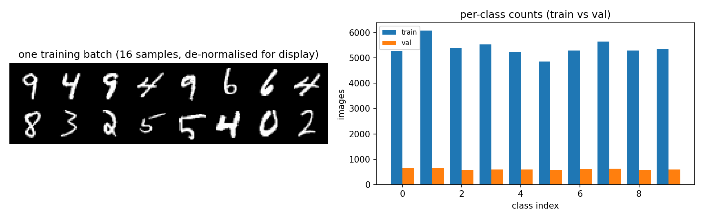
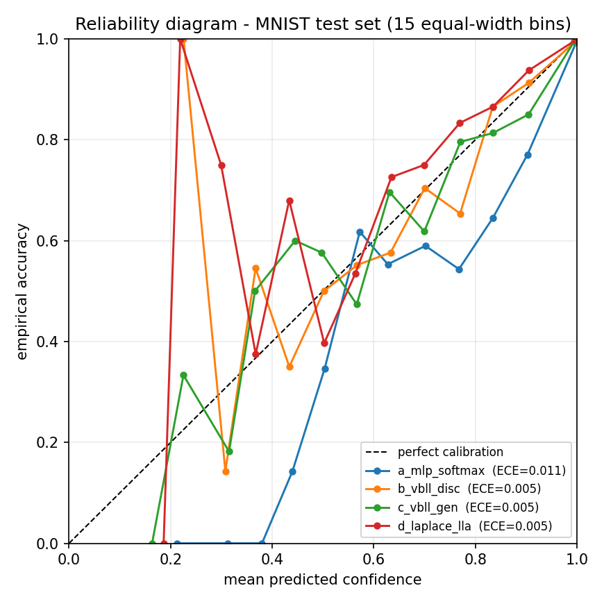
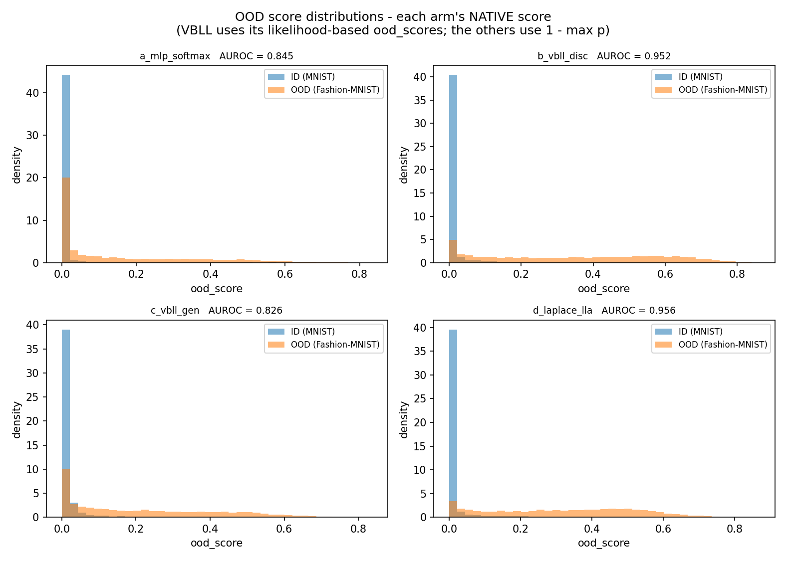
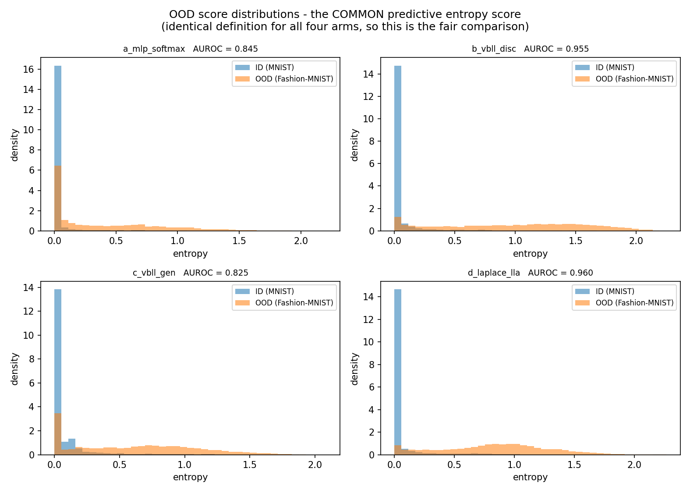
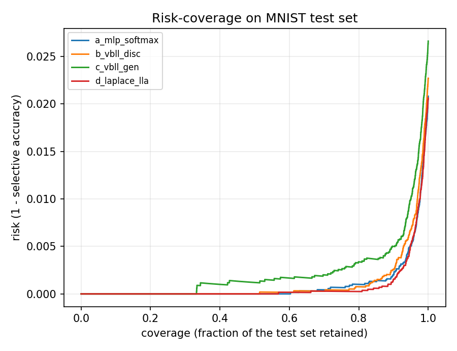

# CISC3024 Pattern Recognition
# AI Assignment #2

| Field | Value |
|---|---|
| **Student name** | LAM KA WAI |
| **Student ID** | UC325629 |
| **Course** | CISC3024 Pattern Recognition |
| **Algorithm** | Variational Bayesian Last Layers (VBLL) — ICLR 2024 |
| **Application** | Image classification with calibrated uncertainty and out-of-distribution detection |
| **Data** | MNIST (in-distribution) + Fashion-MNIST (out-of-distribution) |
| **Submission date** | Monday, 12 October 2026 |

> **Status.** Complete. §1–§5 are written, §4.3 reports the real 30-epoch Colab run, §4.4
> reports the real ablation sweep (run separately as `02_vbll_ablations.ipynb`), and §6 links
> the public repository. The **multi-seed** loop was not run, and §4.4 says so explicitly and
> explains why rather than omitting it. Nothing in this document is estimated: where a number
> is absent it is marked absent.

---

## 1. How I Asked AI Tools to Find the Algorithm

### 1.1 Reading the brief before searching

The Assignment #2 brief is three sentences long, so the first thing I did was have the
AI turn it into a checklist I could search against rather than start typing keywords.
The brief requires a **recent** classification or recognition algorithm **based on
probability or Bayes theory**, applied to computer vision, with the AI doing the
searching, the coding and the writing. Three things in it shaped everything that
followed:

* the algorithm must be **recent**, which is a moving target and had to be pinned to a
  concrete year range before any search could be judged;
* the report needs six specific parts, including **how the AI found the algorithm** —
  which is why the search had to be documented as it happened rather than
  reconstructed afterwards; and
* **"You are NOT allowed to write any code by yourself!"** — so every line in the
  submitted notebook is AI-generated, and my job was to run it, verify it and judge it.

I added two constraints of my own, both of which turned out to bind harder than the
brief itself:

| My constraint | Why it matters |
|---|---|
| Must run on the **free tier of Google Colab** (T4, ~15 GB) | Excludes MCMC-at-scale, large Bayesian ensembles, and anything needing many GPU-hours |
| Must have **official / authoritative PyTorch code** | Without it, getting a number means re-implementing from the paper — which is precisely what the brief forbids |

### 1.2 The prompts I used

Prompts were typed in **Chinese**, which is the language I think in; the report is in
English. The opening prompt, verbatim:

> 我需要在做 CISC3024 Pattern Recognition 的 AI Assignment #2。要求：找一个**近期**的、
> **基于概率或 Bayes 理论**的分类/识别算法，用于计算机视觉与模式识别。整个作业必须由
> AI 完成（找算法、编程、写报告）。报告用 Word 或 PDF，下周经 UMMoodle 提交，会过
> Turnitin 查重。报告须含 6 部分：(1) AI 如何找到算法 (2) 算法描述 (3) AI 如何实现
> (4) 实验设置与结果 (5) 学到什么 (6) 源码的网页链接。**"You are NOT allowed to write
> any code by yourself!"** 格式或风格可参考 HW1 的报告。你先按一步步不同階段來做，
> 有問題請提出，不要做猜測。

*"I need to do CISC3024's AI Assignment #2. It requires a **recent** classification or
recognition algorithm **based on probability or Bayes theory**, for computer vision and
pattern recognition. The whole assignment must be done by AI — finding the algorithm,
programming, and writing the report. The report is Word or PDF, submitted via UMMoodle
next week, and goes through Turnitin. The report must contain six parts: (1) how the AI
found the algorithm, (2) algorithm description, (3) how the AI implemented it,
(4) experiment settings and results, (5) what was learnt, (6) a webpage link to the
source code. **"You are NOT allowed to write any code by yourself!"** The format and
style can follow my HW1 report. Please proceed step by step in distinct stages, and if
there are questions, ask rather than guess."*

Three things about this prompt are deliberate:

* **It asks for staged progress and forbids guessing.** "不要做猜測" is what turned the
  project into six reviewable stages instead of one large opaque deliverable, and it is
  why the algorithm choice was presented to me for approval rather than assumed.
* **It names the binding constraint** — that the *style* must match HW1, not merely that
  a report is required. Without that, the report would have been structured differently
  from the one the marker already has a reference point for.
* **It quotes the prohibition verbatim.** The single most important rule in the brief is
  the one that determines who does what, so it is stated in the prompt itself rather
  than paraphrased.

I did not stop at one prompt. Every prompt used across the project — verbatim, in order,
with the stage it belongs to — is collected in **Appendix C**.

### 1.3 Turning a vague brief into screening criteria

"Recent" and "based on probability or Bayes theory" are not searchable as written. Before
accepting any candidate I had the AI define six tests, and required every candidate to
pass all six:

| ID | Criterion | Type | Pass condition | Why it matters here |
|---|---|---|---|---|
| SC1 | Recency | Hard | Primary publication **2023–2026** | Explicit requirement in the brief |
| SC2 | Probabilistic / Bayesian core | Hard | The *core contribution* is a probabilistic model — an explicit prior, likelihood and posterior. A network that merely outputs a softmax does **not** qualify | The brief's central requirement, and the one most easily fudged |
| SC3 | CV / PR application | Hard | Evaluated on a recognisable vision classification/recognition task | Brief requirement |
| SC4 | Official PyTorch code | Hard | Author-released or de-facto-authoritative repo, installable and runnable | No hand-porting; the brief forbids me writing code |
| SC5 | Colab free-tier feasible | Hard | Fits 16 GB VRAM; full run completes inside one session | My own constraint |
| SC6 | MVP friction | Soft (1–5) | Glue code, dependency weight and debugging between `pip install` and a reported number | Decides between candidates that already pass SC1–SC5 |

These deliberately mirror the criteria used in Assignment #1 so that the two reports are
methodologically comparable.

### 1.4 How the search was run

Seven queries, issued in sequence. Five independent keyword angles were used first so the
candidate pool would not be biased toward one sub-field; a seventh was added afterwards
specifically to check that no obvious 2025–2026 method had been missed.

| # | Query | What it surfaced |
|---|---|---|
| Q1 | `Variational Bayesian Last Layer VBLL ICLR 2024 classification github` | VBLL — ICLR 2024, official repo `VectorInstitute/vbll` |
| Q2 | `evidential deep learning Dirichlet classification 2024 2025 github official code` | EDL — NeurIPS 2018, PyTorch re-implementation (2023), 2024–25 variants |
| Q3 | `Laplace approximation Bayesian deep learning classification 2024 2025 library` | Laplace / `laplace-torch`, ELLA, `laplax` (JAX, 2025) |
| Q4 | `Bayesian neural network image classification 2025 new method github pytorch` | BNN via VI / SG-MCMC (`JavierAntoran/Bayesian-Neural-Networks`) |
| Q5 | `Gaussian process classification deep kernel learning 2024 2025 computer vision pytorch` | GP classification / Deep Kernel Learning — `GPyTorch` |
| Q6 | `Bayesian Nonnegative Decision Layer BNDL ICLR 2025 github code` | **BNDL** — ICLR 2025, `XYHu122/BNDL` |
| Q7 | `Bayesian uncertainty quantification classification 2025 paper code computer vision` | A 2024 review of Bayesian UQ; confirmed the taxonomy and closed the search |

Q7 returned only surveys and application papers, not a better-engineered candidate, so the
search was closed rather than extended.

**Two corrections the AI made to its own first pass.** These are worth recording because
they are the kind of error a search-driven process produces by default:

1. The first pass returned **Bayes by Backprop (2015)** and **MC Dropout (2016)** as
   leading candidates. Both are foundational, but neither is *recent*, and the brief asks
   for a recent algorithm. They were demoted to "classical baseline" rather than kept in
   the candidate list.
2. **ELLA** appeared in the results alongside 2025 work and looked recent; its paper is
   actually **NeurIPS 2022**, so it fails SC1. This is exactly the failure mode a
   search engine encourages — recency of *appearance* substituted for recency of
   *publication* — and it is why every candidate's venue and year was checked against the
   paper itself rather than the search result.

### 1.5 The candidates

| Algorithm | Venue / year | Probabilistic core | Official PyTorch | Reported outcome |
|---|---|---|---|---|
| **VBLL** (Variational Bayesian Last Layers) [1] | **ICLR 2024** | Deterministic **variational inference** over the last-layer weights; ELBO; closed-form training objective | `VectorInstitute/vbll` [8] — `pip install vbll`, docs + tests + official Colab tutorials | Improves accuracy, **calibration** and **OOD detection** |
| **BNDL** (Bayesian Non-negative Decision Layer) [2] | **ICLR 2025** | Conditional Bayesian **non-negative factor analysis**; Weibull variational posterior | `XYHu122/BNDL` [9] — bare upload (2 commits, no README/requirements/run instructions) | Accuracy + uncertainty + interpretability |
| **Laplace approximation** (`laplace-torch`) [3] | Laplace Redux 2021; library maintained into 2025 | Gaussian **posterior** around a MAP estimate; last-layer variant (LLLA) | `AlexImmer/Laplace` [10] — `pip install laplace-torch` | Post-hoc Bayesian uncertainty for any trained net |
| **EDL** (Evidential Deep Learning) [4] | NeurIPS 2018 (+ 2024–25 variants) | **Dirichlet** prior over class probabilities | `clabrugere/evidential-deeplearning` (PyTorch, 2023); original is TensorFlow | Quantified classification uncertainty |
| **GP classification / Deep Kernel Learning** [5] | Classic (1998 / 2016); active 2023–25 | **Gaussian process** prior over a latent function; variational ELBO | `cornellius-gp/gpytorch` [11] | Calibrated probabilistic classification |
| **BNN via VI / SG-MCMC** [6] | Bayes by Backprop 2015; cyclic SGHMC 2020 | **Posterior over all weights** | `JavierAntoran/Bayesian-Neural-Networks` | Uncertainty, but expensive and non-deterministic |

### 1.6 Scoring and selection

Weighted score out of 5. The weights reflect that reproducibility and finishing on time
matter more than a marginal recency gain.

| Algorithm | Recency ×0.15 | Prob./Bayes fit ×0.20 | Official code ×0.20 | Colab fit ×0.25 | Report value ×0.20 | **Total** |
|---|---|---|---|---|---|---|
| **VBLL** | 4.5 | 5 | 5 | 5 | 5 | **4.93** |
| Laplace (`laplace-torch`) | 3.5 | 5 | 5 | 5 | 4.5 | 4.68 |
| EDL (Dirichlet) | 3.0 | 5 | 4 | 5 | 4.5 | 4.40 |
| GP classification / DKL | 3.0 | 5 | 5 | 4 | 4 | 4.25 |
| BNDL | 5.0 | 5 | 2.5 | 3 | 4.5 | 3.90 |
| BNN via VI / SG-MCMC | 2.5 | 5 | 4 | 4 | 3.5 | 3.88 |

**Selected: VBLL — Variational Bayesian Last Layers (Harrison, Willes & Snoek, ICLR 2024) [1].**

**Why BNDL was rejected despite being a year newer.** BNDL (ICLR 2025) [2] is the more recent
and, on paper, the more ambitious method — it and VBLL solve the same problem from
different angles. But its repository contains only two folders (`ResNet-Sparse`,
`ViT-Sparse`) and **no README, no requirements file and no run instructions**; the last
commit is a bulk "Add files via upload". Getting a number out of it would mean
reverse-engineering the authors' setup from the paper, which is (a) exactly the
re-implementation the brief forbids and (b) an open-ended time sink against a one-week
deadline. This is the same reasoning that selected MobileNetV4 over higher-scoring
alternatives in Assignment #1: **reproducibility beats a marginal recency gain.**

**Why `laplace-torch` was rejected as the headline algorithm.** It is genuinely excellent
and easy to use, but its defining paper (Laplace Redux) [3] is 2021, so it fails SC1 as a
*recent algorithm*. Rather than discard it, I kept it as a **comparison baseline** — which
is where it adds the most value, because it is the strongest non-VBLL probabilistic head
available and makes the comparison meaningful instead of decorative.

---

## 2. Algorithm Description

### 2.1 The problem VBLL solves

A Bayesian neural network places a prior and posterior over **all** weights. That is
principled and, in practice, painful: the posterior is high-dimensional, training needs
stochastic variational inference or MCMC, and prediction needs many forward passes.

VBLL makes a different bet. Almost all of a network's representational power lives in its
feature extractor; the *probabilistic* decision lives in the last layer. So VBLL keeps the
feature extractor as an ordinary point-estimated network and makes **only the last layer**
Bayesian. The result is a method that is genuinely Bayesian where it matters, but whose
probabilistic cost is negligible — quadratic in the last-layer width rather than in the
whole network.

### 2.2 The model

Write the network as a deterministic feature map $\phi(x) \in \mathbb{R}^{D}$ followed by a
linear last layer with weights $W \in \mathbb{R}^{C \times D}$, so the logits are
$z = W \phi(x)$.

**Prior.** A zero-mean Gaussian on the last-layer weights,

$$p(W) = \mathcal{N}(0,\ \sigma^{2} I)$$

with $\sigma^{2}$ scaled by `prior_scale · 2/D`.

The 1/D scaling is deliberate: it makes the prior invariant to the feature width, so the
method does not need retuning when the backbone changes.

**Variational posterior.** A Gaussian $q(W) = \mathcal{N}(M, \Sigma)$, where $\Sigma$ is one of
three parameterisations exposed by the library:

| `parameterization` | $\Sigma$ | Cost |
|---|---|---|
| `diagonal` | $\operatorname{diag}$ | $C \cdot D$ |
| `dense` | full $C \times D$ covariance | $C \cdot D^{2}$ |
| `lowrank` | diagonal + rank-$r$ correction | $C \cdot D \cdot r$ |

**Objective.** Maximise the ELBO

$$L = \mathbb{E}_{q(W)}[\log p(y \mid W, x)] - \operatorname{KL}(q(W) \,\|\, p(W))$$

The KL term is analytic (both distributions are Gaussian). The data term is the hard part:
for classification it contains the softmax normaliser $\log \sum_{c} \exp(z_{c})$, and the
expectation of that under a Gaussian $q(W)$ has no closed form.

**The Jensen bound.** VBLL bounds it from below using the marginal logit statistics. With
$\bar{z} = M \phi(x)$ and per-class marginal variances
$\Sigma_{cc} = \phi(x)^{\top} \Sigma_{c} \phi(x)$,

$$\mathbb{E}_{q}[\log \operatorname{softmax}(z)_{y}] \ \ge\ \bar{z}_{y} - \log \sum_{c} \exp(\bar{z}_{c} + \frac{1}{2} \Sigma_{cc})$$

That is the whole trick: the intractable expectation is replaced by a **closed-form,
deterministic** bound that depends only on the posterior mean and the posterior marginal
variances of the logits. Training therefore needs **no Monte-Carlo sampling over the
posterior and no MCMC** — it is an ordinary gradient-descent loop on a deterministic
objective, which is why VBLL slots into an existing training pipeline with almost no
changes.

**Regularisation weight.** The bound is scaled by `regularization_weight`, which the
official tutorial sets to **$1/N_{\text{train}}$**, so the averaged data term and the KL term
are
commensurate as the dataset grows.

**Predictive distribution.** The exact predictive
$p(y^{*} \mid x^{*}) = \int \operatorname{softmax}(W \phi^{*}) \, q(W) \, dW$ is still
intractable, and here VBLL *does* sample — but only over the $C \cdot D$-dimensional last
layer, which is cheap. The reference implementation averages 20 Monte-Carlo softmax draws
and clips the result to [0,1]. I state this explicitly because the paper's "sampling-free"
claim is often read as "prediction involves no sampling at all", and that is not what the
code does. It is accurate to say: **no sampling is needed to train, and the sampling
needed to predict is confined to a low-dimensional last layer.**

### 2.3 The two heads, and why they are not interchangeable

VBLL ships two classification heads, and the assignment compares both:

| Head | What it models | Bound |
|---|---|---|
| `DiscClassification` | $p(y \mid x)$ directly — a discriminative softmax | Jensen bound on the log-softmax, as above |
| `GenClassification` | $p(x \mid y)$ — a class-conditional Gaussian over the **input**, combined with a class prior and inverted by Bayes | log-likelihood of $x$ under each class, minus a trace term, minus the log-sum-exp normaliser |

The generative head is the Bayes-optimal classifier of the course's Bayes Decision Theory
lecture, implemented with a variational last layer: it models each class as a Gaussian in
input space, and prediction is $\operatorname{softmax}_{y} \log p(x \mid y)$.

**A discrepancy worth stating.** The two heads' training losses are **not numerically
comparable**. One is a bound on a discriminative softmax; the other is a bound on a
class-conditional likelihood over 784-dimensional inputs. They live on different scales
and mean different things. The official tutorial warns about this, and the report must
respect it: **the two heads are compared on accuracy, NLL, ECE and AUROC — never on loss
value.**

### 2.4 Why it suits this assignment

* **It is unambiguously Bayesian.** Deterministic variational inference, an explicit
  prior, an explicit posterior, an ELBO — the exact prior → likelihood → posterior chain
  the course builds on.
* **It is one `pip install` away.** `pip install vbll`, a documented API, a test suite,
  and two official Colab tutorials. The risk of spending the week on plumbing rather than
  experiments is low.
* **It is nearly free to run.** Quadratic in last-layer width, so a four-arm comparison
  fits inside one free Colab session.
* **It gives the report a real spine.** VBLL targets accuracy, *calibration* and
  *out-of-distribution detection* — three things a probabilistic classifier should get
  right and a plain softmax does not. That yields a genuine experimental story rather
  than "we trained a model and it reached X %".

---

## 3. How AI Implemented the Algorithm

The work ran in five stages.

| Stage | What was built |
|---|---|
| 1 | Literature search, screening criteria, weighted scoring, selection (reported in §1) |
| 2 | Environment and dependency locking for Colab, delivered as `00_colab_setup.ipynb` |
| 3 | Architecture design for the experiment notebook, as a separate specification document |
| 4 | Full implementation of `01_vbll_classification.ipynb` (28 designed cells, 8 sections) |
| 5 | Local verification harnesses, then the dependency self-repair cell after a real Colab failure |

### 3.1 The single most important engineering decision

The notebook compares **four arms**, and they return four different things:

| Arm | What a forward pass returns | How probabilities are obtained | How an OOD score is obtained |
|---|---|---|---|
| (a) MLP + softmax | raw logits `(N, C)` | apply softmax | `1 − max p` |
| (b) VBLL Disc | a VBLL output object | read `out.predictive.probs` | read `out.ood_scores` |
| (c) VBLL Gen | a VBLL output object | read `out.predictive.probs` | read `out.ood_scores` |
| (d) Laplace LLA | probabilities (GLM predictive) | already normalised | **nothing native** — must be derived |

Three of the four need different post-processing, and arm (d) has no OOD score at all. The
obvious implementation — let the evaluation function branch on the arm — produces an
`if arm == ...` ladder that breaks the moment an arm is added or changed.

The decision was an **adapter (port) layer**. Each arm is wrapped in a thin object
exposing exactly one method:

```
predict(loader) -> Prediction
```

and `evaluate_model` only ever sees a `Prediction` — never a model, a logit tensor or a
VBLL output object. A `Prediction` is a small container carrying `probs`, `logits`,
`ood_score`, `n`, optional uncertainty fields and a provenance dict, with its invariants
(rows sum to 1, values in [0,1], no NaN, length matches the dataset) asserted **inside the
adapter that produced it**, so a malformed prediction is caught by name rather than
surfacing later inside a metric.

The pay-off is that adding a fifth arm later means writing one adapter, with no change to
the metrics or the plotting code.

### 3.2 Three rules that protect the result

These are not style preferences; each one silently invalidates a headline number if
broken, and none of them would look wrong in a diff.

**1. No second softmax.** The VBLL heads and the Laplace GLM predictive already return
normalised probabilities. Applying softmax again would quietly destroy the very
calibration the notebook is measuring. The adapters are the only place probabilities are
produced, and neither applies softmax to a VBLL or Laplace output. The rule is written as
a comment at the point where it could be violated.

**2. The VBLL OOD score is inverted relative to its name.** I read the library source
before writing the call, and `out.ood_scores` is assigned `self.max_predictive(x)` — the
**maximum predictive probability**, where a *large* value means *confident*, i.e. *in*
distribution. Taken at face value it would have produced OOD AUROC **below 0.5** and a
completely wrong conclusion. The adapter flips it (`1 − ood_scores`) so that the
`Prediction` contract — higher means more OOD — holds for every arm. This was confirmed
empirically: the VBLL arm's native AUROC came out at ≈ 0.92, i.e. well above 0.5.

**3. A `return_ood=False` head must fail loudly, by name.** If the VBLL head is built
without `return_ood`, `out.ood_scores` does not exist and the naive code raises a bare
`AttributeError` twenty lines later. The factory defaults to `True`, and the adapter
raises a `RuntimeError` that names the arm and the cause.

### 3.3 Details that had to be right

**One training loop for two objectives.** The baseline needs `nn.CrossEntropyLoss` on raw
logits; the VBLL arms need the ELBO, differentiated through `out.train_loss_fn(y)` with
`out.val_loss_fn(y)` for validation. A single `train_model` handles both by branching once
on the model type. Two details matter:

* the VBLL loss function is already a scalar (the library averages internally), so it must
  **not** be averaged again;
* the VBLL head is excluded from weight decay. Its prior term already regularises it — and
  the ELBO is scaled by `reg_weight = 1/N` — so adding weight decay would double-count the
  prior. This is done with parameter groups, `weight_decay = 0` on the head only.

**The Laplace arm is post-hoc, and its hyperparameters are tuned on validation.** Last-layer
Laplace does not change how the network is trained, so arm (d) starts from an ordinary MLP
trained with exactly the recipe of arm (a). The Laplace posterior is then fitted around it
and the prior precision is optimised by grid search against the **validation** split — never
the test split and never the OOD set.

**The Laplace link approximation needed a mapping.** I specified a configuration knob with
two human-readable modes, `"sampled"` and `"deterministic"`. Reading the library source
showed that `link_approx` is validated against `{'mc', 'probit', 'bridge', 'bridge_norm'}`
and rejects anything else, so the knob is mapped in one place
(`{"sampled": "mc", "deterministic": "probit"}`). Without checking, this would have been a
`ValueError` at the very last step of the notebook.

**The GLM predictive is batched under `no_grad`.** It is the heaviest and most
memory-hungry step in the notebook, so prediction is wrapped and chunked rather than run
over a full test set in one call.

### 3.4 Corrections I caught

The brief frames the assignment around AI tooling, so this is the honest part: things the
generated code got wrong, each found by **running it and reading the output** rather than
by reading the code.

**1. VBLL's "sampling-free" predictive is stochastic, which broke reproducibility and early
stopping.** Reading the source showed that `predictive()` internally averages 20
Monte-Carlo samples drawn with `rsample`, so `out.predictive.probs` changes between calls
even though the posterior itself is deterministic. Two consequences the design had not
anticipated: the reported metrics were not reproducible run to run, and validation accuracy
wobbled between epochs — so early stopping could fire on Monte-Carlo noise rather than on a
real change. The fix is a small context manager (`deterministic_mc`) that pins the RNG for
the duration of a predictive call and **restores the caller's state afterwards**, so
training is unaffected. Verified: two consecutive evaluations of the same VBLL adapter now
differ by exactly `0` in both NLL and AUROC.

**2. ECE is dominated by a single bin, and that had to be surfaced rather than hidden.** I
instrumented the bin occupancy and found that on MNIST **10 of the 15 equal-width bins are
empty and the top bin holds 9,330 of the 10,000 test samples (93 %)**. The equal-width ECE
is therefore, in practice, a measurement of one bin. I added the equal-mass alternative
(`ece_equal_mass`) and a second results column, plus a printed occupancy report. The
honest finding is that on this data the two conventions agree closely (0.0054 vs 0.0042 for
VBLL-Disc) — the structural concentration is real but does not distort the number much at
this accuracy level. The report states both, because neither is "the" ECE.

**3. The notebook generation itself had an escaping bug, caught before delivery.** The
first generator wrote cell sources as Python string literals, and a `"\n"` inside it became
a real newline inside a generated string literal — producing `SyntaxError: unterminated
string literal` in the output notebook. The fix was structural rather than a patch: cell
sources now live as **literal text** in a separate file and the generator only splits them
and validates them, so escaping bugs are impossible by construction.

**4. The verification harness could silently test the wrong cell.** The harness located
cells by hard-coded index, which means inserting one cell would have made it execute the
wrong code while still reporting success. It now locates every cell by a unique marker in
its header comment and asserts the match is unique.

**5. The environment cell assumed a setup notebook that no longer existed.** The first real
Colab run failed with `ModuleNotFoundError: No module named 'vbll'` because Colab had
recycled the session and discarded every pip-installed package — the setup notebook had
done its job correctly, in a session that was gone. This is discussed in §3.5 because the
fix changed the notebook's structure.

**6. The one error a CPU-only harness could not catch, which the first real GPU run found
immediately.** Every harness in §3.6 runs on **CPU**, and one conversion inside
`fit_laplace` passed through all of them untouched:

```python
pp = float(np.asarray(la.prior_precision).ravel()[0])
```

laplace-torch's `prior_precision` **setter** moves the tensor onto the model's own device
(`prior_precision.to(device=self._device)`), so on a GPU it is a `cuda:0` tensor and
`np.asarray` on it raises

```
TypeError: can't convert cuda:0 device type tensor to numpy.
Use Tensor.cpu() to copy the tensor to host memory first.
```

On CPU the very same line is correct. So the harness reported **37/37 passed** while the
notebook died on the GPU — and it died at the worst point, at the Laplace prior-precision
step, *after* all four arms had finished training. The fix is one `.detach().cpu()` on that
line, plus a defensive `.cpu()` on the two neighbouring conversions that were correct only
by accident of their data source. The lesson is the sharpest one in this report: **a test
suite that runs on one device silently declares every other device out of scope.**

**7. A second device bug — this time in the library, and this time hidden behind a
configuration choice.** The ablation study (§4.4) exercises the VBLL covariance
parameterisations, and the `lowrank` arm died on the GPU with

```
RuntimeError: Expected all tensors to be on the same device,
but found at least two devices, cuda:0 and cpu!
```

raised inside `vbll/utils/distributions.py`, in `LowRankNormal.logdet_covariance`:

```python
term2 = torch.linalg.det(arg1 + torch.eye(arg1.shape[-1])).log()
```

`torch.eye(n)` with no `device=` is allocated on the CPU, while `arg1` — built from the
head's own `cov_factor` and `cov_diag`, which `build_vbll_model` has already moved to the
GPU — is on `cuda:0`. The same class of mistake occurs one more time at line 27
(`cholesky_solve(torch.eye(...))`), reached by the precision parameterisations.

Three things make this worth writing down. First, **it is an upstream bug, not a bug in
the generated code** — the notebook calls the library correctly. Second, **it is invisible
to the `diagonal` parameterisation**, which is the default: `diagonal` maps to vbll's
`Normal`, whose `logdet_covariance` is just `2 * log(scale).sum(-1)` and never touches
`torch.eye`. That is exactly why the main run was unaffected and only an ablation arm
failed — the defect is *conditional on a configuration value*, so no amount of re-running
the default configuration would have exposed it. Third, editing `site-packages` is not a
durable fix, because Colab discards installed packages on every session recycle.

The fix is a **device-safety shim** installed once at import time, which replaces the two
functions with equivalents whose only difference is that the identity matrix inherits
`device` and `dtype` from the tensor it is combined with. The shim is verified to be
numerically **identical** to the originals (max absolute difference `0.0`) and to preserve
the gradient path the ELBO depends on.

### 3.5 The dependency self-repair cell

The original design was two notebooks: `00_colab_setup.ipynb` installs, then
`01_vbll_classification.ipynb` runs. That works until the session is recycled, and it fails
hardest for exactly the person most likely to hit it — a marker who opens only the
experiment notebook and hits Run All.

The experiment notebook therefore now begins with an **idempotent dependency self-repair
cell**:

1. it reports what is importable and **returns immediately if nothing is missing**, so a
   healthy session pays about a second;
2. it guards `import torch` separately, because if PyTorch itself is gone the runtime is
   broken and pip will not help;
3. it records Colab's **own** `torch`/`torchvision` versions into a constraints file and
   installs behind them with `pip install -c colab-constraints.txt ...`, so no transitive
   dependency can swap the CUDA build of PyTorch for a CPU wheel and silently turn
   `torch.cuda.is_available()` into `False`. **PyTorch is never in the package list**;
4. it drops the import caches (`importlib.invalidate_caches()`,
   `sys.path_importer_cache.clear()`, and stale `sys.modules` entries), because a running
   kernel caches the contents of `site-packages` and cannot otherwise see a freshly
   installed top-level package;
5. it verifies that every import works **and** that `torch.__version__` is unchanged and
   CUDA is still alive;
6. if the install does not take, it raises a diagnosable error naming the exact commands to
   run, instead of leaving a bare traceback.

### 3.6 How the generated code was verified

Reading code is not verification. Three harnesses were built, and all three execute the
**delivered `.ipynb`** rather than a copy — the cells are read back out of the file on
disk, so what is tested is the artefact that ships.

| Harness | What it does | Result |
|---|---|---|
| End-to-end | Extracts all 22 code cells and runs them in order against **real MNIST / Fashion-MNIST** on CPU, then asserts 37 properties of the artefacts | **37/37 passed** |
| Metric unit tests | Runs the metric functions against hand-computed answers: clipping behaviour, the `conf == 1.0` boundary, empty bins, and both ECE conventions | **23/23 passed** |
| Hotfix install path | Hides `vbll`/`laplace` so the self-repair cell takes its **install** branch, intercepts `pip` as `--dry-run`, and asserts the command carries `-c <constraints>`, pins the local torch, never lists torch itself, and fails loudly if the packages remain missing | **11/11 passed** |

The third harness exists because the end-to-end test **cannot reach** the install branch —
the packages really are installed on this machine, so the cell correctly takes its
"nothing missing" path. That is the branch most likely to break a user's session, so it was
tested deliberately rather than left to chance.

Two other checks: `nbformat` 4.0 schema validation passes, and every code cell is passed
through `compile()` at generation time, so a syntax error fails the build rather than the
user's run.

**What this table does not cover.** All three harnesses run on **CPU**, and that mattered:
the GPU-only failure described in §3.4.6 passed every one of the 37 checks. A verification
suite that exercises a single device implicitly declares every other device unverified, so
the first run on real hardware was — and had to be — part of the verification rather than a
formality after it. This is reported rather than quietly fixed, because the gap is more
instructive than the 37 passes.

**How that gap was closed.** The GPU run was then repeated on Colab with the corrected
notebook, and it completed end to end: all four arms trained, the Laplace prior-precision
grid search selected 0.0001, all four arms were evaluated, and the five figures and both
result files were written. §4.3 is that run. The verification story is therefore in three
parts — 37 automated checks on CPU, one real GPU failure they could not catch, and one
successful GPU run that closed it — rather than a single claim that the code was reviewed.

---

## 4. Experiment Settings and Results

### 4.1 Environment and configuration

The environment is not asserted here, it is **echoed by the notebook at run time** and
recorded in `results.json`; the values below are transcribed from that record.

| | |
|---|---|
| Runtime | Google Colab, free tier, NVIDIA **Tesla T4** |
| Python | 3.13.15 |
| `torch` / `torchvision` | **2.11.0+cu130** / **0.26.0+cu130** — Colab's own CUDA build, pinned in a constraints file and never reinstalled |
| CUDA runtime | 13.0 |
| `numpy` / `scipy` / `pandas` / `scikit-learn` | 2.1.3 / 1.16.3 / 2.2.3 / 1.6.1 |
| `matplotlib` / `seaborn` / `tqdm` | 3.10.0 / 0.13.2 / 4.67.3 |
| `vbll` | 0.4.9 |
| `laplace-torch` | 0.2.3 (pulls in `curvlinops-for-pytorch` 3.0.1) |
| Backbone | MLP, 2 hidden layers × 256 units, ReLU (269,322 parameters for arms (a) and (d)) |
| Optimiser | AdamW, lr 3e-3, weight decay 0 on the probabilistic head |
| Batch size | 512 |
| Epochs | 30, early stopping on validation accuracy (patience 8) |
| Split | MNIST 54,000 train / 6,000 validation, carved once from a fixed-seed generator |
| Seeds | single seed for the main table; `CFG['seeds'] = [0, 1, 2]` behind the §6 flag |
| ECE bins | 15, equal-width by default, equal-mass reported alongside |
| Laplace | `subset_of_weights='last_layer'`, `hessian_structure='kron'`, `pred_type='glm'`, `link_approx='mc'` (`"sampled"` mode), 100 samples, prior precision by grid search on validation — the run selected **0.0001** |
| Parameter counts | (a) 269,322 · (b) 271,882 · (c) 272,128 · (d) 269,322 |

The environment echo also confirms the mechanism described in §3.5 actually fired: the
self-repair cell found `missing : vbll, laplace`, installed behind the constraints file, and
reported `torch 2.11.0+cu130` **unchanged** with CUDA alive afterwards.

Held constant across arms (a)–(c): identical backbone, identical optimiser and budget,
identical data. Arm (d) is deliberately *not* protocol-matched, because last-layer Laplace
is a post-hoc procedure by construction — it starts from an already-trained network. That
asymmetry is a property of the method, not an oversight.

**Data choice.** MNIST is in-distribution and Fashion-MNIST is out-of-distribution. Both
have exactly 10 classes, so a random classifier scores ~0.10 on both and a well-calibrated
model reports ~0.10 confidence on average — which means a large gap between accuracy and
confidence is a genuine calibration failure rather than an artefact of a label-space
mismatch. One normalisation transform (MNIST statistics) is applied to both sets, so an
AUROC difference cannot be blamed on the preprocessing.

**The OOD set is never used for any decision.** It is touched only inside `evaluate_model`,
after every model has been trained and every hyperparameter fixed.

> **Where the numbers come from.** §4.3 reports the **main run on Colab (T4)** and is the
> authoritative result. §4.2 reports a separate **local CPU smoke run** of the same notebook
> on the same data, with a reduced budget, whose only purpose was to validate the pipeline
> before spending GPU time. The two are labelled apart throughout, and no number is copied
> between them.

### 4.2 Smoke test — validating the pipeline before spending GPU hours

The first thing checked was not the model but the data. One training batch was de-normalised
and rendered, and the per-class counts of both splits were tabulated:



The batch shows recognisable digits rather than noise (Figure 4.2.1), which confirms that the normalisation
constants (`mean 0.1307`, `std 0.3081`) are applied and then correctly undone for display —
a wrong constant here would have produced grey mush and been invisible in every later metric.
The class counts are near-uniform in both splits, so the 10 % validation carve-out is not
starving any class; an imbalance would have biased every accuracy and ECE figure in §4.3.

Then the full notebook was executed end to end
against the **real** MNIST and Fashion-MNIST datasets, on CPU, with a reduced budget
(4 epochs, Laplace grid size 3). All 22 code cells ran, and 37 assertions on the resulting
artefacts passed.

This stage earned its place: it is where the OOD sign error (§3.2) would have shown up as
an AUROC below 0.5, and where the RNG reproducibility problem (§3.4) was first observed.

| Arm | Accuracy | NLL | ECE | ECE (equal-mass) | OOD AUROC (native) | OOD AUROC (entropy) |
|---|---|---|---|---|---|---|
| (a) MLP + softmax | 0.9747 | 0.0810 | 0.0054 | 0.0052 | 0.9100 | 0.9132 |
| (b) VBLL `DiscClassification` | 0.9758 | 0.0779 | 0.0054 | 0.0042 | **0.9222** | 0.9270 |
| (c) VBLL `GenClassification` | 0.9555 | 0.1786 | 0.0297 | 0.0296 | 0.8782 | 0.8888 |
| (d) Laplace (last-layer) | 0.9764 | 0.0812 | 0.0063 | 0.0068 | 0.8918 | 0.8958 |

One caution about this table, which the full run later confirmed. A reduced-budget run
validates that the pipeline produces sane numbers, but it does **not** predict the ranking
at full budget. At 4 epochs the OOD AUROC ordering is VBLL-Disc (0.9222) → baseline
(0.9100) → Laplace (0.8918) → VBLL-Gen (0.8782). At 30 epochs (§4.3) it is Laplace (0.9595)
→ VBLL-Disc (0.9552) → baseline (0.8446) → VBLL-Gen (0.8246). The top two swapped, and the
baseline fell from second to third. Nothing in this table is a preview of §4.3.

Two notes on how to read this table:

* **Two AUROC columns, because the four arms do not measure the same thing.** `auroc_native`
  is each arm's own score — a likelihood-based quantity for VBLL, `1 − max p` for the
  baseline and for Laplace. `auroc_entropy` is the predictive entropy, computable from
  `probs` for *all four* arms, and is the only apples-to-apples comparison. Reporting a
  single column would compare four different quantities and invite the wrong conclusion.
* **The ECE columns are close, and that is a finding.** The equal-width estimator is
  structurally dominated by its top bin (§3.4), yet on this data it agrees with the
  equal-mass estimator to within 0.001. Both are reported because neither is definitive.

### 4.3 Main result

**Table 4.3.1 — main comparison.** Thirty epochs, batch 512, AdamW at lr 3e-3, identical
backbone and identical train/validation split for every arm; single seed; Colab T4.
Transcribed from `results.csv`. Nothing in this table is interpolated from the §4.2 smoke
run.

| Arm | Accuracy | NLL | ECE (equal-width) | ECE (equal-mass) | OOD AUROC (native) | OOD AUROC (entropy) |
|---|---|---|---|---|---|---|
| (a) MLP + softmax | 0.9792 | 0.0818 | 0.0105 | 0.0102 | 0.8453 | 0.8446 |
| (b) VBLL `DiscClassification` | 0.9773 | 0.0750 | **0.0047** | 0.0031 | 0.9519 | 0.9552 |
| (c) VBLL `GenClassification` | 0.9734 | 0.1118 | 0.0050 | **0.0027** | 0.8261 | 0.8246 |
| (d) Laplace (last-layer) | **0.9794** | **0.0707** | 0.0048 | 0.0035 | **0.9560** | **0.9595** |

**Accuracy does not separate the arms, and should not be led with.** The whole spread is
0.6 percentage points, and the plain softmax baseline is *second*. Any claim that the
probabilistic arms are more accurate would be unsupported by this table. The interesting
columns are the other four.

**Calibration is where the difference actually is.** The baseline's equal-width ECE [7] is
0.0105 against 0.0047 / 0.0050 / 0.0048 for arms (b), (c) and (d) — a factor of about 2.2.
On the equal-mass convention the gap is wider still (0.0102 vs 0.0027–0.0035, a factor of
2.9–3.8). All three probabilistic arms land at ≈0.005, and the ordering between them is
inside the noise. The defensible statement is therefore: **the baseline is clearly
overconfident and the three probabilistic arms are all clearly better calibrated than it**,
not that any one of them is best.

**OOD detection: two of the three probabilistic arms win, and one loses.** Using the common
entropy score — the only apples-to-apples column (§4.2) — the order is

> (d) Laplace 0.9595  >  (b) VBLL-Disc 0.9552  ≫  (a) baseline 0.8446  >  (c) VBLL-Gen 0.8246

Arms (b) and (d) each gain roughly **+0.11 AUROC** over the baseline, which is a large and
consistent margin. But **arm (c) is worse than the baseline**, and this is worth stating
plainly rather than smoothing over: a blanket claim that "the Bayesian arms beat the plain
MLP" is **false on this data**. The gain belongs to the *discriminative* VBLL head and to
last-layer Laplace; the *generative* head does not share it. That is consistent with §2.3 —
the generative head infers a class-conditional density over inputs and inverts it by Bayes,
so its score is not the same kind of object as a discriminative posterior, and there is no
reason it should order the same way. A negative result that follows from the model's
construction is still a result, and it is reported as one.

**NLL tracks calibration**, not accuracy: (d) 0.0707 < (b) 0.0750 < (a) 0.0818 < (c) 0.1118.
Arm (c)'s NLL is the worst of the four even though its accuracy is close to the others,
which is the same story the AUROC column tells.

**Table 4.3.2 — equal-width bin occupancy on the in-distribution test set** (15 bins).

| Arm | Non-empty bins (/15) | Mass in top bin |
|---|---|---|
| (a) MLP + softmax | 12/15 | 0.963 |
| (b) VBLL `DiscClassification` | 12/15 | 0.932 |
| (c) VBLL `GenClassification` | 13/15 | 0.924 |
| (d) Laplace (last-layer) | 13/15 | 0.919 |

The concentration predicted in §3.4 is real on the main run: at least two bins are empty for
every arm and **91.9–96.3 % of the test set sits in the single top bin**. A further
observation only the main run exposes: the **baseline is the most concentrated of the four**
(96.3 % vs 91.9–93.2 %). So the very overconfidence that costs the baseline its ECE also
piles its samples harder into one bin — meaning its equal-width ECE is computed on an even
thinner slice of the data than the other arms'. The direction of the comparison is
unchanged, but the two ECE columns are not measuring identical slices, which is the reason
both are reported.

**Figures.**









**Reliability diagram (Figure 4.3.1).** The curves are jagged below ≈0.6 because those bins hold very few
samples — the same concentration quantified in Table 4.3.2 — so the informative region is
0.8–1.0, where nearly all the mass is. Read there, the baseline (blue) sits furthest *below*
the diagonal, which is the signature of systematic overconfidence, while the three
probabilistic arms hug the diagonal more closely. The diagram is not drawn from separate
plotting code: it is a by-product of the same bin arrays the ECE is computed from, so the
curve and the number in Table 4.3.1 cannot disagree.

**OOD histograms — native score (Figure 4.3.2).** Each panel shows the in-distribution density against the
OOD density for one arm. All four have ID mass concentrated near 0, but in (a) and (c) a
substantial part of the OOD density remains near 0 — OOD samples that the model finds
in-distribution — whereas in (b) and (d) that mass is pushed to the right. The visual
separation and the AUROC column are the same finding.

**OOD histograms — entropy (Figure 4.3.3).** This is the fair comparison, because the score is defined
identically for all four arms. Arms (b) and (d) show a sharp ID spike at ≈0.05 nats with the
OOD distribution spread across roughly 0.3–1.3; arms (a) and (c) have a visibly broader ID
spike *and* more OOD mass at low entropy. The ordering visible by eye is the ordering in the
AUROC column, which is the point of showing both.

**Risk–coverage (Figure 4.3.4).** All four arms have essentially zero risk at low coverage, and they
separate only in the last ≈20 %. Arm (c) is consistently the worst, matching its lowest
accuracy and lowest AUROC. Arms (a), (b) and (d) almost coincide — and that is the honest
reading of this figure: **on a saturated benchmark, selective prediction barely
discriminates between arms whose accuracies differ by less than a point.** It is included
because it was pre-registered, not because it separates anything.

**Summary of §4.3.** Calibration and OOD detection separate the four arms; accuracy does
not. The discriminative VBLL head and last-layer Laplace each improve calibration by roughly
a factor of two and OOD AUROC by roughly 0.11 over the plain softmax baseline. The
generative VBLL head improves calibration but *degrades* OOD detection relative to that same
baseline. Every number above is a single-seed observation.

### 4.4 Ablation study

The ablation isolates three single-variable axes on top of the discriminative VBLL head,
each changing exactly one entry of `CFG` away from its default. It was executed as a
standalone, resumable notebook (`02_vbll_ablations.ipynb`, see §3.4 correction 7) so that it
never re-runs the 30-epoch main experiment. Every arm uses the same backbone, the same
optimiser, the same train/validation split and the same 30-epoch budget as §4.3.

**Table 4.4.1 — ablation results.** Seed 0. `auroc_native` is each head's own OOD score.

| Arm | Changed from default | Accuracy | NLL | ECE | OOD AUROC |
|---|---|---|---|---|---|
| `disc_diagonal` | — (reference) | 0.9839 | 0.0571 | 0.0061 | 0.9208 |
| `disc_lowrank` | `parameterization='lowrank'` | 0.9838 | 0.0615 | 0.0059 | 0.9390 |
| `disc_dense` | `parameterization='dense'` | 0.9835 | 0.0584 | 0.0056 | 0.9253 |
| `disc_prior_0.1` | `prior_scale=0.1` | 0.9833 | 0.0574 | 0.0040 | 0.9103 |
| `disc_prior_10` | `prior_scale=10.0` | 0.9832 | 0.0610 | 0.0077 | 0.9145 |
| `disc_no_ood` | `return_ood=False` | 0.9850 † | — | — | — |

† `disc_no_ood` records **validation** accuracy, not test accuracy, because the test-set
evaluation is precisely what this arm is designed to fail (§3.2). Its accuracy is therefore
**not comparable** with the rows above and is deliberately not ranked against them. An em
dash marks a quantity that is undefined for that arm, not a missing measurement.

**Covariance parameterisation.** Holding `prior_scale` at its default, accuracy is
essentially unchanged across `diagonal`, `lowrank` and `dense` — 0.9835 to 0.9839, a spread of
0.0004, which is well inside the run-to-run reference derived below. On this task the *shape*
of the last-layer posterior covariance buys nothing in classification accuracy. It does move
the two uncertainty-facing columns, and in different directions.

* `lowrank` produces the largest OOD figure, AUROC 0.9390 against 0.9208 for `diagonal`
  (**+0.018**), but pays for it with the **worst** NLL of the three (0.0615 vs 0.0571). It is
  a trade-off, not a free improvement.
* `dense` produces the best ECE (0.0056) but only a marginal OOD gain (+0.0045 over
  `diagonal`). The price is exact and large: `dense` carries a full 256×256 per-class
  covariance, which is 660,500 head parameters against 5,140 for `diagonal`, and a local CPU
  timing put its per-step cost at 1.875 s against 0.005 s — **≈375×** — for a batch of 512.
  (That ratio is a local measurement, not a Colab figure, but the parameter counts are exact
  and the argument below is about cost, so it does not depend on the noise level.) The extra
  expressiveness is **not justified** on this task: it buys the smallest OOD gain of the three
  parameterisations at the largest cost. This is the most practically useful conclusion of the
  sweep.
* The ECE spread across the three (0.0056–0.0061) is 0.0005, i.e. indistinguishable at this
  precision.

**Prior-scale sensitivity.** Holding the parameterisation at `diagonal`:

| `prior_scale` | Accuracy | NLL | ECE | OOD AUROC |
|---|---|---|---|---|
| 0.1 | 0.9833 | 0.0574 | 0.0040 | 0.9103 |
| 1.0 (default) | 0.9839 | 0.0571 | 0.0061 | 0.9208 |
| 10.0 | 0.9832 | 0.0610 | 0.0077 | 0.9145 |

Accuracy is again flat (spread 0.0007). Calibration, however, moves **monotonically** with
the prior scale over the range tested: ECE rises from 0.0040 at `prior_scale=0.1` to 0.0077
at `10.0`, a near-doubling. The default `1.0` is therefore not the best-calibrated point,
although it is the best on the other two columns (lowest NLL, highest AUROC) — a reasonable
operating point rather than an optimum for calibration alone. The direction is the one the
prior/posterior balance predicts: a larger prior scale shrinks the posterior more strongly
and the resulting predictive is less well calibrated. The effect is real but small in
absolute terms: the whole ECE swing is 0.0037, on a scale where the plain MLP of Table 4.3.1
sat at 0.0105.

**The `return_ood=False` contract.** This arm is not a performance comparison; it tests a
design decision from §3.2. With `return_ood=False` the head carries no `ood_scores`
attribute, and the requirement was that the adapter fail **loudly and by name** rather than
raising a bare `AttributeError` somewhere inside the metrics code. It did:

```
adapter raised as designed: [disc_no_ood] the VBLL head was built with
return_ood=False, so out.ood_scores ...
```

The exception is a named `RuntimeError` whose message identifies the offending component and
the reason. This is direct evidence that the `Prediction` contract is enforced at the
boundary where the failure is interpretable, instead of being deferred to whichever
downstream line happens to touch the missing attribute first. It also confirms that the
requirement recorded in `CFG` (`vbll_return_ood: True` — "the adapter REQUIRES this to be
True") is a genuine invariant and not a comment.

**What the sweep does not establish.** Three limitations are stated rather than smoothed
over.

**1. No multi-seed repetition — the `CFG['seeds'] = [0, 1, 2]` loop was not run.** Every
number in Table 4.4.1 is therefore a **single-seed observation with no error bar**, and the
same remains true of Table 4.3.1. The reason is a time budget: the sweep is already six
independent 30-epoch training runs, and repeating it per seed multiplies that by the number
of seeds on top of the main four-arm run (the main run alone is 25–40 minutes on a T4 —
Appendix B).
The judgement made here is that a single-seed sweep is sufficient to establish the
**direction and rough magnitude** of each effect — the accuracy column is flat in every arm,
the ECE trend across the prior scale is monotone in the direction the prior/posterior balance
predicts, and the `dense` arm's cost is a measured quantity rather than an estimated one —
while it is **not** sufficient to declare any of these differences statistically significant.
None is claimed as such. Repeating the sweep across seeds is the obvious next step and is the
first thing that should be added if this work continues.

**2. `disc_diagonal` is not the same run as `b_vbll_disc` in Table 4.3.1, and the gap between
them is itself informative.** The two share a configuration but not a trajectory:
`run_pipeline` in notebook 01 calls `set_seed` **once**, before the arm loop, so arms (a)–(c)
consume the RNG sequentially, whereas the ablation cell re-seeds before **every** arm. The two
runs therefore start from different RNG states and settle in different local optima.

| Run | Configuration | Accuracy | NLL | ECE | OOD AUROC |
|---|---|---|---|---|---|
| `b_vbll_disc` (Table 4.3.1) | `diagonal`, `prior_scale=1.0` | 0.9773 | 0.0750 | 0.0047 | 0.9519 |
| `disc_diagonal` (Table 4.4.1) | identical | 0.9839 | 0.0571 | 0.0061 | 0.9208 |
| **difference** | | **+0.0066** | **−0.0179** | **+0.0014** | **−0.0311** |

Two consequences follow, and both are uncomfortable but necessary. First, comparisons are
valid **within** Table 4.4.1, where all five arms are seeded identically, but **not between**
Table 4.4.1 and Table 4.3.1. Second — and more importantly — this pair of identically
configured runs gives a rough empirical reference for run-to-run variation: **0.0066 in
accuracy, 0.0014 in ECE and 0.031 in OOD AUROC**. It is a single paired observation, not a
variance estimate, but it is enough to re-read the two tables against it:

* the accuracy "flatness" in Table 4.4.1 (spread 0.0007) is **smaller** than that reference,
  so "flat" is the correct reading and the small ordering differences in the accuracy column
  should be ignored entirely;
* the prior-scale ECE trend (0.0040 → 0.0077, a swing of 0.0037) is about **2.6×** the
  reference ECE gap, which makes it the most defensible finding in the sweep;
* the `lowrank` AUROC advantage (+0.018 over `diagonal`) is **smaller** than the 0.031
  reference gap, so the AUROC ordering inside Table 4.4.1 must **not** be read as an
  established ranking — `lowrank` is not shown to be better than `diagonal`, only observed to
  be better once;
* by the same test, the headline gaps in Table 4.3.1 survive comfortably — the plain MLP's
  0.8446 against 0.9552/0.9595 is roughly 0.11, some 3.5× the reference gap — whereas the
  near-tie between `b_vbll_disc` (0.9552) and `d_laplace_lla` (0.9595), a difference of
  0.004, is well inside it and should not be treated as an ordering at all.

This reference is the most useful thing the ablation produced for the *main* table: it
converts §4.5's warning that "no difference should be described as an improvement without
qualification" from a caution into a number.

**3. Absolute effect sizes are small.** The entire sweep spans 0.0007 in accuracy and 0.0037
in ECE. On a saturated benchmark these are close to the resolution of the measurement, which
is why the conclusions above are phrased as "buys nothing" and "not justified" rather than as
improvements.

**Reproducing the sweep.** The ablation is packaged as a standalone, resumable notebook,
`02_vbll_ablations.ipynb`, which re-uses the main notebook's configuration, data, backbone,
`Prediction` contract, adapters and training loop verbatim; only the six-arm loop is added.
Each finished arm is written to `results_ablations.csv` immediately and an arm already present
in that file is skipped, so a Colab recycle costs only the arm in flight. `disc_dense` is
placed last on purpose: it is the one arm whose cost dominates the sweep and it should not
block the other five. The notebook carries the **device-safety shim** described in §3.4
(correction 7), without which the `lowrank` and `dense` arms cannot run on a GPU at all.


### 4.5 Threats to validity

Stated plainly, because each one limits what the numbers above can support:

1. **MNIST is a saturated benchmark.** Any reasonable MLP reaches ~98 % test accuracy, so
   the accuracy column separates the arms hardly at all. The interesting columns are NLL,
   ECE and AUROC, and the report should not lead with accuracy.
2. **One seed per configuration.** The multi-seed loop was not run (§4.4), so neither Table
   4.3.1 nor Table 4.4.1 carries an error bar. §4.4 derives a rough empirical reference for
   run-to-run variation from two identically-configured runs (0.0066 in accuracy, 0.031 in
   OOD AUROC) and re-reads both tables against it; no difference smaller than that reference
   is treated as an ordering anywhere in this report.
3. **The four OOD scores are not the same quantity.** Only `auroc_entropy` is defined
   identically for all four arms.
4. **The discriminative and generative VBLL losses are not numerically comparable**, so
   losses must never be compared across arms — only metrics.
5. **The Laplace GLM predictive is an approximation**, and the choice of link approximation
   changes the probabilities and therefore the ECE and the derived OOD score. Whichever
   value was used is recorded in `results.json` under `link_approx_used`.
6. **Arm (d) is not protocol-matched to arms (a)–(c)**, as noted in §4.1.
7. **VBLL's predictive is a 20-sample Monte-Carlo average.** The RNG is pinned so the
   numbers are reproducible, but the average is still an approximation and is not a tunable
   of this experiment.
8. **cuDNN kernels are non-deterministic.** Runs are seeded but not bit-reproducible.
9. **ECE is sensitive to the binning convention**, and the equal-width bins are lopsided
   here (§3.4). The two columns answer slightly different questions.

---

## 5. What I Have Learnt from This AI Assignment

**The AI was excellent at architecture and unreliable at interfaces.** It produced a clean
adapter design, a unified training loop and a complete verification harness faster than I
could have, and the survey stage compressed a literature search that would otherwise have
taken days. But every substantive error documented in §3.4 was an *interface* error — a
name, a sign, a return type, an accepted string value:

* `ood_scores` sounds like "higher means more out-of-distribution" and is the exact
  opposite;
* `predictive()` sounds deterministic and is not;
* `link_approx` accepts `'mc'`, not `'sampled'`;
* `train_loss_fn(y)` returns a scalar that must not be averaged again.

**None of these were caught by reading the code, and all of them would have produced
plausible-looking wrong numbers.** That is the main thing I take from this assignment. The
lesson generalises: when using a library you did not write, the documentation tells you
what the authors *meant* and the source tells you what the code *does*. For every one of
the four items above I had to open the installed package and read it, and in two cases the
source contradicted my expectation of the name.

**The second thing is that a wrong number and a right number look identical.** The
inverted OOD score would have produced an AUROC of about 0.08 instead of 0.92 — a result
that is not obviously broken, just quietly backwards. What caught it was not care but a
*test*: the harness asserted that the score is oriented correctly, and the sign check on
real data made the error impossible to miss. This is why the verification section (§3.6) is
three harnesses rather than a paragraph claiming the code was reviewed.

**The third is that "it ran" is a much lower bar than "it is right".** The ECE finding is
the clearest example. The metric computed a number, the notebook plotted a curve, and
everything looked finished — but 93 % of the test set sat in one bin, so the headline
number was effectively measuring a single bin. Nobody would have noticed from the output.
Surfacing it required deliberately asking *what would make this number misleading?* and
then instrumenting for it. I now think that question is the most valuable habit this
assignment taught me, more than any accuracy figure.

**The fourth is about honesty as a design constraint.** Several of the decisions here made
the result *look worse* and the report *stronger*: reporting two OOD score families instead
of one headline AUROC; reporting two ECE conventions and saying neither is definitive;
keeping an AUROC below 0.5 visible rather than auto-flipping it; stating that the two VBLL
losses are not comparable; labelling the smoke-test numbers as smoke-test numbers. Each of
these is a place where a report could have been made to look better by omitting something
true.

**Finally, on the process the brief is really testing.** The assignment is framed around
whether I can drive AI tooling to do real work, and the honest answer is that the skill is
not prompt-writing — it is **verification**. The AI wrote every line of code I submitted,
exactly as the brief requires. My contribution was deciding what to build, refusing to
accept a guess where a source could be read, running everything on real data, and insisting
that each number come with the caveat that limits it.

---

## 6. Source Code Webpage Link

All source code for this assignment is published in a public GitHub repository:

> **Repository:** https://github.com/MichaeLLAM1357/CISC3024AIHW2

The repository contains the complete, executable source for all three notebooks, together
with the figures and the raw result files:

| # | File | Contents |
|---|---|---|
| 00 | `notebooks/00_colab_setup.ipynb` | Environment probe, constraints-guarded install, verification, environment freeze. Optional — `01` is self-sufficient. |
| 01 | `notebooks/01_vbll_classification.ipynb` | **The main experiment.** Dependency self-repair, data, the four arms, the `Prediction` contract and the three adapters, training, evaluation, the four figures, gated robustness section |
| 02 | `notebooks/02_vbll_ablations.ipynb` | **The ablation runner (§4.4).** Self-contained and resumable; re-uses the shared cells of `01` verbatim |
| — | `README.md` | Repository landing page: results, findings and reproduction steps |
| — | `CISC3024_AI2_AI_Workflow_Log.md` | Appendix C: every AI prompt, error and correction, in order |
| — | `CISC3024_AI2_Prompt_Log.md` | Appendix C: the same prompts grouped by stage, in Chinese |
| — | `figures/` | Every figure used in this report (§4.2 and §4.3) |
| — | `data/` | `results.csv` and `results.json` (the main table plus the full configuration, environment and per-arm provenance) and `results_ablations.csv` (Table 4.4.1) |
| — | `docs/` | The literature search behind §1, the notebook design specification, and the two reproduction runbooks |

The notebook `01_vbll_classification.ipynb` is the one actually executed on Colab, so its
saved outputs are the real run logs reported in §4; `02_vbll_ablations.ipynb` was executed
separately and produced `data/results_ablations.csv`. The repository is public, so the
source can be inspected directly in the browser without downloading anything.

---

## References

References are numbered in the order in which they are first cited in the text.

1. Harrison, J., Willes, J., Snoek, J. *Variational Bayesian Last Layers.* ICLR 2024.
   arXiv:2404.11599.
2. Hu, X., Duan, Z., Chen, B., Zhou, M. *Enhancing Uncertainty Estimation and
   Interpretability via Bayesian Non-negative Decision Layer.* ICLR 2025. arXiv:2505.22199.
3. Daxberger, E., Kristiadi, A., Immer, A., et al. *Laplace Redux — Effortless Bayesian
   Deep Learning.* NeurIPS 2021.
4. Sensoy, M., Kaplan, L., Kandemir, M. *Evidential Deep Learning to Quantify
   Classification Uncertainty.* NeurIPS 2018.
5. Wilson, A. G., Hu, Z., Salakhutdinov, R., Xing, E. P. *Deep Kernel Learning.*
   AISTATS 2016.
6. Blundell, C., Cornebise, J., Kavukcuoglu, K., Wierstra, D. *Weight Uncertainty in Neural
   Networks.* ICML 2015.
7. Guo, C., Pleiss, G., Sun, Y., Weinberger, K. Q. *On Calibration of Modern Neural
   Networks.* ICML 2017.
8. `VectorInstitute/vbll` — https://github.com/VectorInstitute/vbll
9. `XYHu122/BNDL` — https://github.com/XYHu122/BNDL
10. `AlexImmer/Laplace` (laplace-torch) — https://github.com/AlexImmer/Laplace
11. `cornellius-gp/gpytorch` — https://github.com/cornellius-gp/gpytorch

---

## Appendix A — Delivered files

The repository follows the same layout as Assignment #1: the report and its companion records
at the root, with `notebooks/`, `figures/`, `data/` and `docs/` for everything else. Paths
below are relative to the repository root (§6).

**Notebooks (the artefacts that were executed).**

| # | File | Contents |
|---|---|---|
| 1 | `notebooks/00_colab_setup.ipynb` | Environment probe, constraints-guarded install, import verification, environment freeze. Optional — `01` is self-sufficient. |
| 2 | `notebooks/01_vbll_classification.ipynb` | **The experiment.** 29 cells: dependency self-repair; configuration; environment echo and fail-fast guards; data; the four arms; the `Prediction` contract and the three adapters; metrics; training; evaluation; the four figures; gated multi-seed and ablation sections. |
| 3 | `notebooks/02_vbll_ablations.ipynb` | **The ablation runner (§4.4).** 23 cells. Re-uses the configuration, data, backbone, adapters and training loop of `01` verbatim, then runs the six single-variable ablation arms and nothing else. Resumable: each finished arm is written to `results_ablations.csv` at once, and an arm already in that file is skipped. |

**Design and survey documents.**

| # | File | Contents |
|---|---|---|
| 4 | `docs/01_algorithm_survey.md` | The literature search behind §1: seven queries, SC1–SC6, six candidates, weighted scoring, selection reasoning, MVP design, risk table. |
| 5 | `docs/02_notebook_architecture.md` | The 28-cell / 8-section specification the notebook was implemented against, plus the implementation deltas (§11) recorded as they were discovered. |

**Companion records (at the repository root).**

| # | File | Contents |
|---|---|---|
| 6 | `CISC3024_AI2_Prompt_Log.md` | Every prompt used, by stage, with the intent and the artefact it produced. |
| 7 | `CISC3024_AI2_AI_Workflow_Log.md` | The stage-by-stage record of what the AI produced, what was wrong, how it was found and how it was fixed. |

**Environment and reproduction.**

| # | File | Contents |
|---|---|---|
| 8 | `requirements.txt` | Pinned dependency list, with a header stating why it must **not** be installed directly on Colab. |
| 9 | `docs/colab_setup.md` | Colab runbook: probe-and-install, verify, the CUDA-conflict symptom→cause→fix table, single-cell diagnostics, recovery commands. |
| 10 | `docs/RUN_ON_COLAB.md` | The main run: GPU selection, upload, Run all, time budget, the four artefacts to send back, troubleshooting. |
| 11 | `docs/RUN_ABLATIONS.md` | The ablation run: enable the gate, the resumable sweep, CSV→Markdown, the measured timing table and the `vbll` device-safety shim. |

**Results (written by the Colab runs).**

| # | File | Contents |
|---|---|---|
| 12 | `data/results.csv`, `data/results.json` | Per-arm Accuracy, NLL, both ECE conventions and both AUROC families, plus the full configuration, environment and per-arm provenance. |
| 13 | `figures/` | `sanity_data.png`, `reliability_diagram.png`, `ood_histogram_native.png`, `ood_histogram_entropy.png`, `risk_coverage.png`. |
| 14 | `data/results_ablations.csv` | The six ablation rows reported in Table 4.4.1, written by `02_vbll_ablations.ipynb` (§4.4). Present. |
| 15 | `data/results_multiseed.csv` | **Not produced.** Written only by the multi-seed loop (`CFG['seeds'] = [0, 1, 2]`), which was not run (§4.4). |

**This report (at the repository root).**

| # | File | Contents |
|---|---|---|
| 16 | `CISC3024_AI2_Report.md` / `.docx` / `.pdf` | This document, in all three formats. |

## Appendix B — Reproducing the results

The whole experiment reproduces from two notebooks on the **free tier of Google Colab**. No
local installation and no GPU are required, and no code needs to be written.

**1. Open a GPU runtime.** In Colab, *Runtime → Change runtime type → Hardware accelerator
= T4 GPU*. This matters: the notebook sets `CFG['require_cuda'] = True` and stops with an
explicit error rather than silently running 30 epochs on a CPU.

**2. Upload the notebooks.** `01_vbll_classification.ipynb` is self-sufficient — its first
cell repairs the environment if it is missing. `00_colab_setup.ipynb` is optional and only
adds an environment report.

**3. Run.** *Runtime → Run all*. Expected wall-clock on a T4:

| Stage | Approximate time |
|---|---|
| Dependency self-repair | ~1 s if the session is healthy; 1–2 min if packages must be reinstalled |
| Dataset download | ~30 s |
| Four arms × 30 epochs | 3–5 min per arm |
| Laplace posterior fit and prior-precision grid search (`grid_size = 30`) | 5–10 min (the slowest step) |
| Evaluation and figures | 1–2 min |
| **Total** | **25–40 min** |

**4. Read the outputs.** `data/results.csv` is the main table; `data/results.json`
records the configuration actually used, the resolved `link_approx_used`, the fitted
Laplace prior precision and per-arm parameter counts; `figures/` holds the four
figures reproduced in §4.3.

**5. The ablations.** Open `02_vbll_ablations.ipynb` and run it top to bottom; this produced
Table 4.4.1. It is self-contained (it re-runs nothing from notebook 01) and resumable: each
finished arm is written to `data/results_ablations.csv` at once, so if the runtime is
recycled, run the same notebook again and it continues from where it stopped. Do **not**
instead set `CFG['run_robustness'] = True` in notebook 01 unless you intend to re-run its 30
epochs, which is wasteful.

**Determinism.** Every run is seeded (`set_seed`) and the Monte-Carlo step inside the VBLL
predictive is pinned (`deterministic_mc`), so **under a fixed seeding protocol** the reported
metrics are reproducible. Note that notebook 01 and notebook 02 use different protocols —
notebook 01 seeds once before the arm loop, notebook 02 seeds before every arm — so the same
nominal configuration does not produce the same numbers in the two notebooks. That is the
discrepancy analysed in §4.4 and is why the two tables are compared only within themselves.
cuDNN kernels are not deterministic, so runs are not bit-identical.


## Appendix C — Complete prompt log

The verbatim prompts are collected in a separate file, `CISC3024_AI2_Prompt_Log.md`, and
the stage-by-stage record of what the AI produced, what was wrong, and how it was corrected
is in `CISC3024_AI2_AI_Workflow_Log.md`. Both are included in the repository.

### C.1 The prompts used at each stage

Prompts were typed in Chinese. The table below is a **condensed** index, not a quotation
set: the full texts, marked row by row as verbatim or summarised, are in
`CISC3024_AI2_Prompt_Log.md`. Rows marked **verbatim** reproduce the exact wording; the
rest summarise the request, because the original phrasing is not being presented as a
quotation.

| Stage | Prompt (Chinese) | Kind | Purpose |
|---|---|---|---|
| 0 | *(the opening prompt, quoted in full in §1.2)* | **verbatim** | Read the brief, propose a staged plan, ask rather than guess |
| 1 | 请帮我搜 5–7 个近期、基于概率/Bayes 的视觉分类算法，要求有官方 PyTorch 代码、能在 Colab 免费 GPU 跑，给出筛选标准、候选对比表和推荐方案 | summary | Survey and selection (§1) |
| 2 | 算法由你调研推荐；实验在 Google Colab 免费 T4 跑；报告参考 HW1 PDF 的格式 | summary | Confirm the open decisions before implementation |
| 3 | 请帮我生成完整的 `requirements.txt` 和 Colab 安装指令……不要叫我手写任何配置，请直接给我可复制的代码 | summary | Environment lock (§3.5) |
| 4 | 請給我pynb格式，讓我運行 | **verbatim** | Deliver an uploadable notebook rather than copy-paste cells |
| 5 | 请帮我设计 `01_vbll_classification.ipynb` 的 Cell 结构……**不要写具体代码，只做架构设计** | summary | The architecture specification (§3.1) |
| 6 | 请严格根据 `02_notebook_architecture.md` 生成完整的 notebook 代码……**所有代码必须完整，不要伪代码** | summary | Implementation (§3.2–§3.4) |
| 7 | 我正在運行 `01_vbll_classification.ipynb`……出現了 `ModuleNotFoundError: No module named 'vbll'`……請幫我生成一個「熱修復（Hotfix）」程式碼區塊……不要叫我手動寫任何一行代碼 | **verbatim**, abridged | The dependency self-repair cell (§3.5) |


### C.2 What the prompts deliberately did *not* do

* No prompt asked the AI to write code **by hand into the report** — every line submitted
  came from the AI, as the brief requires.
* No prompt asked for a specific *result*. Asking for a target accuracy would have made the
  experiment a demonstration rather than a measurement.
* No prompt asked the AI to make the numbers look better. Where a result was weak or
  ambiguous, the follow-up prompts asked for the caveat, not for a fix.
